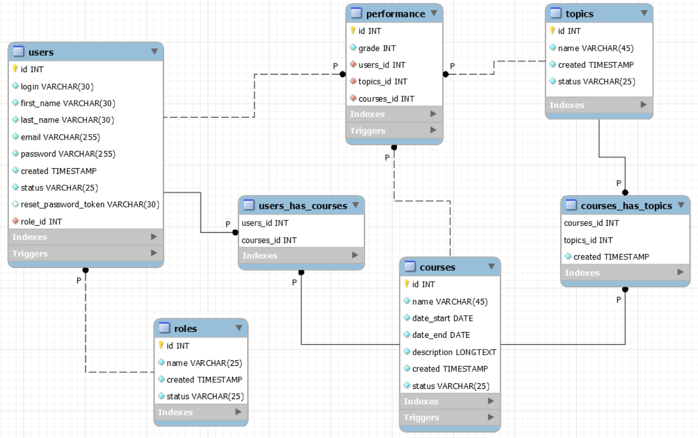

  Elective
There is a list of courses divided into topics. One teacher is assigned to each course. It is 
necessary to implement the following functionality:
- sort courses by name (az, za), duration, number of students enrolled in the course;
- a selection of courses related to a specific topic;
- a selection of the particular teacher courses.
  The student enrolls in one or more courses, registration data is stored. At the end of the
  course the teacher gives the student a grade, which is stored in the journal.
  Each user has a personal account, which displays brief information about the user, as well as
  for the student:
- a list of courses for which the student has registered but which have not yet begun;
- a list of courses for which the student has registered and which are in progress;
- a list of completed courses with information about grades;
  for the teacher:
- viewing and editing an e-journal for assigned courses.
  The system administrator has the rights:
- registration of the teacher and assignment of the course to him;
- adding, deleting, editing a course;
- blocking, unlocking the student.

Requirements for implementation:
1. Based on the entities of the subject area, create classes that correspond to them.
2. Classes and methods must have names that reflect their functionality and must be
   be distributed across packages.
3. The code must comply with the Java Code Convention.
4. Information about the subject area should be stored in a relational database (as a DBMS
   It is recommended to use MySQL or PostgreSQL).
5. To access the data, use the JDBC API using a ready-made or
   a pool of connections developed by yourself.

It is NOT allowed to use ORM frameworks.

6. The application must support work with the Cyrillic alphabet (be multilingual), including
   storing information in the database:
   a. it should be possible to switch the interface language;
   b. there should be support for input, output and storage of information (in the database),
   recorded in different languages;
   c. at least two languages should be selected: one based on the Cyrillic alphabet (Ukrainian or Russian),
   the other based on the Latin alphabet (English).

7. The application architecture must comply with the MVC template.

The use of MVC frameworks is NOT allowed.

8. When implementing business logic, you must use design patterns: Team,
   Strategy, Factory, Builder, Singleton, Front Controller, Observer, Adapter, etc.

The use of templates must be justified
9. Using servlets and JSPs, implement the functionality given in the task statement the task.
10. Use Apache Tomcat as a servlet container.
11. On JSP pages, use tags from the JSTL library and developed custom tags (at least one
    custom tag library tag and one tag file tag).
12. Implement protection against re-sending data to the server when the page is refreshed
    (implement PRG).
13. When developing, use sessions, filters, listeners.
14. The application should implement authentication and authorization, differentiation of rights
    access of system users to program components. Password encryption is encouraged.
15. Implement an event log in the project using the log4j library.
16. The code must contain documentation comments (all top-level classes, non-trivial methods
    and constructors).
17. The application must be covered by unit tests (minimum percentage of coverage is 40%).
    Writing integration tests is encouraged.
18. Implement a mechanism for pagination of data pages.
19. All input fields should be with data validation.
20. The application should correctly respond to errors and exceptions of various kinds (the end user should not see the
    the end user should not see the stack trace on the client side).
21. Independent expansion of the task statement in terms of functionality is encouraged!
    captcha, generating reports in different formats, etc.)
22. The use of HTML, CSS, JS frameworks for the user interface (Bootstrap, Materialize,
    etc.) is encouraged!

Three days before the start of the project defense (interview), you must prepare 
a database schema as a separate file, as well as provide a link to the repository with the project

## Extra functionality
- send an email when you reset your password, enroll/leave a course
- captcha for login
- three failed login attempts and the user will be redirected to the password reset page
- print reports (for all courses and course with grades)
- autoload page every 30 minutes for update data and after 61 minutes to end session
- two indexes for courses (name) and users (login) in the database for faster information retrieval
- pagination
- error processing
- sort courses by it`s name (using like)
- sort courses by start_date from the current moment and above
- sort courses by user login
- was modernised the functionality "At the end of the course the teacher gives the student a grade, which is stored in the journal" to "The course has a separate grade for each topic and an average overall grade"
- for a better user experience: drop-down lists with up-to-date data, hints, informing the user with messages about the results of his actions, etc.

Application logic:
- created 1 trigger in user for stop changing role from: student ==> teacher and back if he has at least one course 
- created 1 trigger in user for stopping deleting user if user has at least 1 course 
- created 1 stored procedure for checking all statuses in courses (for invoking trigger update in courses)
- created 2 triggers in courses for checking status and date_start/date_end 
- created 1 trigger in performance for deleting topic from course if topic doesn't have score bigger than 0 then it can be deleted (deleted due to user want to leave the course)
- created 1 triggers in performance for checking inputting grade (can be 0 or between 60 and 100) and status must be "CURRENT" (for teacher possibility  to change grades)
- created 1 trigger in performance for cancelling enroll student or add topics to course if courses status not "NOT_STARTED"
- created 1 trigger in users_has_courses to prevent the user from leaving the course unless the course status is "NOT_STARTED"

Database Schema:
